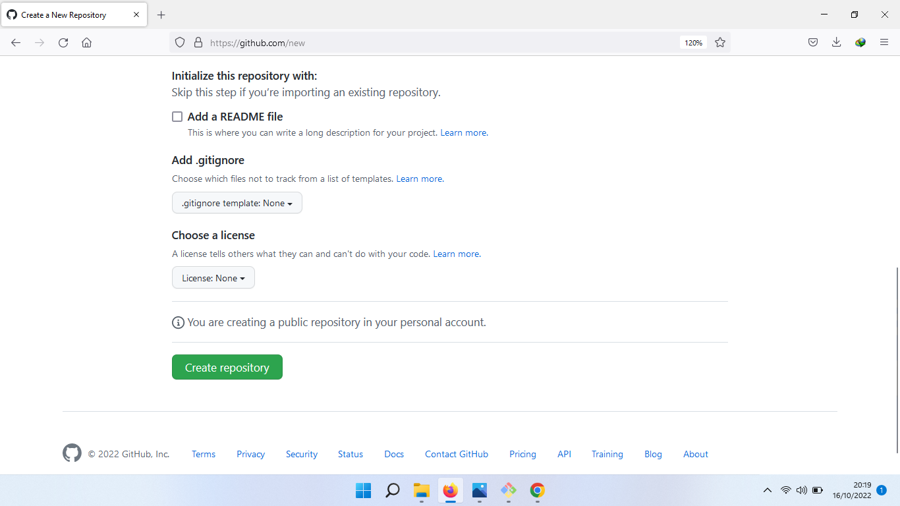
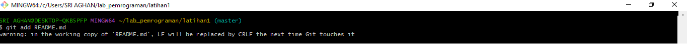

# **latihan 1**
Nama    : Ahmad Faizal Fahmi

NIM     : 312210087

Kelas   : TI.22.A1

Tugas   : 1 Bahasa Pemrograman

Assalamualaikum Wr Wb
berikut ini akan di jelaskan cara Instalasi GIT, Pembuatan Akun Git dan membuat Repositori Baru
Terdapat 2 Hal yang perlu diperhatikan untuk penggunaan GIt yaitu :
1. Instalasi Git

2. Pembuatan Akun Git

3. Membuat Repositori Baru

# **Instalasi Git**
1. Dowload Git pada website resmi di git-scm.com

_download Git sesuai dengan bit yang terdapat di PC atau Leptop (32 atau 64)_

2. Kemudian Install dengan cara klik next 

_Pilih tempat penyimpanan Instalasi sesuai dengan yang di inginkan C:\Program Files\Git_

3. Jika proses instalasi Git telah selesai dilakukan, maka tahap selanjutnya cek melalui Git Bash

_Double Klik pada mouse atau enter untuk mebuka Git Bash_

4. Kemudian buka git cmd untuk mengetahui apakah sudah bisa melakukan proses atau belum jika muncul git version berarti sudah siap melakukan proses. Untuk mengetahui versinya ketikan perintah git --version. Saya memakai versi 2.38.0.windows.1

# **Pembuatan Akun Git**
1. Langkah awal untuk membuat akun Git yaitu akses telebih dahulu pada link http://github.com

2. Kemudian klik Link Sign up

3. Isi biodata yang dibutuhkan, _Email_, _Password_, _Username_, Dst.

4. Selesai

_Tampilan layar setelah selesai melakukan pendaftaran di Git_

# **Membuat Repositori Baru**
1. Klik New (Pojok Kiri Atas) pada halaman https://github.com/

2. isi nama repositori (Repository name) sesuai yang diinginkan,

_catatan : nama repository sampai tercentang warna hijau_

3. Kemudian Klik Create Repository

4. akan diarahkan pada halaman yang berbeda, dan klik _Authorize GitCredentialManager_

5. Selesai

# **Membuat Repositori Local**
1. Buka Git Bush di desktop atau tempat penyimpanan instalasi _C:\Program Files\Git_

2. Kemudian ketikan perintah pada Git Bash _git config --global user.email “nama_user”_ dan _git config --global user.name “nama_user”_

3. untuk membuat direktori baru ketikan perintah _mkdir lab_pemrograman_ Kemudian _cd lab_pemrograman_

4. untuk membuat file Git baru tuliskan _git init_ pada halaman Git Bash

5. Selanjutnya, untuk membuat file README.md tuliskan pada halaman Git Bash perintah _echo “#latihan 1” >> README.md._ kemudian untuk melihat file ketik perintah _ls_

6. cara menambahkan file baru yang telah selesai dibuat ketikkan perintah _git add README.md_. untuk melihat status dapat menuliskan perintah _git status_

7. perubahan yang akan disimpan kedalam database dapat menuliskan perintah _git commit -m “komentar commit"_

8. Selanjutnya, untuk mengecek Repositori yang telah kita buat pada website https://github.com/ ada url github yang telah kita buat, url tersebut untuk perintah _“git remote add origin [url] “ DAN PERINTAH GIT CLONE “ git clone [ url ] “_

9. Jika Sudah mengetahui url github yang terdapat pada website  https://github.com/ lalu ketik perintah git remote add origin [url],urlnya diganti dengan url github anda

10. Kemudian untuk mengirimkan perubahan data local yang telah di edit pada repository local ke server maka tuliskan perintah _git push -u origin master_ pada Aplikasi Git Bash

11. Selesai

Terimakasi.

